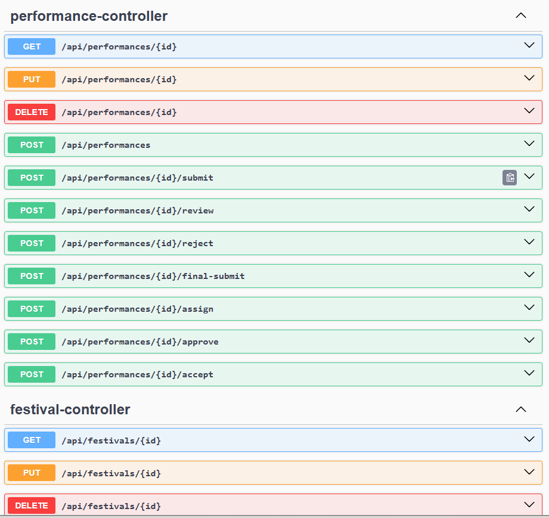

# Folk Festival Backend


This started as my project for the **Software Engineering** course (321-4002) at the University of the Aegean, which I handed in in January 2025. The task was to build only the backend of a system that runs a music festival: artists send in their performances, staff review them, and organizers decide on the final lineup.

In 2026 I came back to it to clean it up and fix the things I didn't have time for back then. More on that [below](#what-i-changed-in-2026).

It's a REST API written in Java with Spring Boot, using MongoDB for storage and JWT for login.

## How it works

Everything revolves around two things: **festivals** and **performances**.

A festival goes through a fixed list of phases, one after the other. An organizer moves it forward by hand:

```
CREATED → SUBMISSION → ASSIGNMENT → REVIEW → SCHEDULING → FINAL_SUBMISSION → DECISION → ANNOUNCED
```

Each phase unlocks different actions. For example, artists can only submit while the festival is in `SUBMISSION`, and staff can only review while it's in `REVIEW`. If you try something in the wrong phase, the API tells you why it refused.

| Phase | Who | What they can do |
|---|---|---|
| SUBMISSION | Artist | Submit a performance (only if every required field is filled in) |
| ASSIGNMENT | Organizer | Assign one staff member to each performance |
| REVIEW | That staff member | Give a score (0–100) and comments |
| SCHEDULING | Organizer | Approve or reject based on the review |
| FINAL_SUBMISSION | Artist | Send the final setlist and time preferences |
| DECISION | Organizer | Pick the stage and time, or reject |

A performance has its own states: `CREATED → SUBMITTED → REVIEWED → APPROVED → SCHEDULED` (or `REJECTED`).

### Roles

Roles are **per festival**, not global. The same person can organize one festival and perform at another. Inside one festival, a user can only have one role, so an artist can never review their own performance.

- **Organizer:** runs the festival and makes the final decisions.
- **Staff:** reviews the performances assigned to them.
- **Artist:** whoever creates a performance becomes an artist for that festival.
- **Visitor:** anyone with no role in the festival. They only see scheduled performances, without scores or internal notes.

## Running it

You need Java 17, Maven and MongoDB (or Docker, which can start MongoDB for you).

```bash
docker compose up -d                        # starts MongoDB, skip this if you already run it
export JWT_SECRET=$(openssl rand -hex 32)   # any random string of 32+ characters
mvn spring-boot:run -Dspring-boot.run.profiles=dev
```

The `dev` profile adds some test users so you can try things right away: `alice` (organizer), `sue` (staff) and `bob`. Their password is `pass`.

Once it's running, all the endpoints are listed at http://localhost:8080/swagger-ui/index.html, where you can also try them out.



There's also a Postman collection in [`postman/`](postman/).

Run the tests with:

```bash
mvn test
```

## Code layout

```
src/main/java/com/folkfest/
├── controller/   REST endpoints
├── service/      the actual rules (who can do what, and in which phase)
├── model/        MongoDB documents
├── repo/         database access
├── dto/          request bodies
├── security/     JWT filter
└── config/       security setup, test data
```

## What I changed in 2026

When I reopened the project, a few things bothered me:

- **The build output (`target/`) was committed** and there was no `.gitignore`. Removed it.
- **The JWT secret was hardcoded** in `application.properties`. It now comes from an environment variable.
- **A visitor could see private data.** `GET /api/performances/{id}` returned review scores and comments to any logged-in user, even though search already hid them. Fixed it, and added a test for it.
- **Some state checks were missing.** You could review a performance that was never submitted, or schedule one that was never approved. Fixed those too.
- **Unexpected errors leaked internal messages** to the client. They're now logged instead, and the client gets a generic message.
- Added **unit tests** (JUnit + Mockito), **Swagger UI**, a **GitHub Actions** build and a `docker-compose.yml` for MongoDB.
- Translated my leftover Greek comments to English and removed some duplicated code.

## What's not done yet

The original assignment asked for more than I built. Here's what's still missing:

- Adding band members and other organizers/staff to a festival through the API
- Merchandise info for performances
- Automatic rejection of approved performances that never got a final submission
- Searching festivals (only listing them for now)
- Anonymous visitors (right now you need an account even to browse)
- Rate limiting and an audit log

I might come back to some of these. If you're reading this and have feedback, I'd be happy to hear it.
